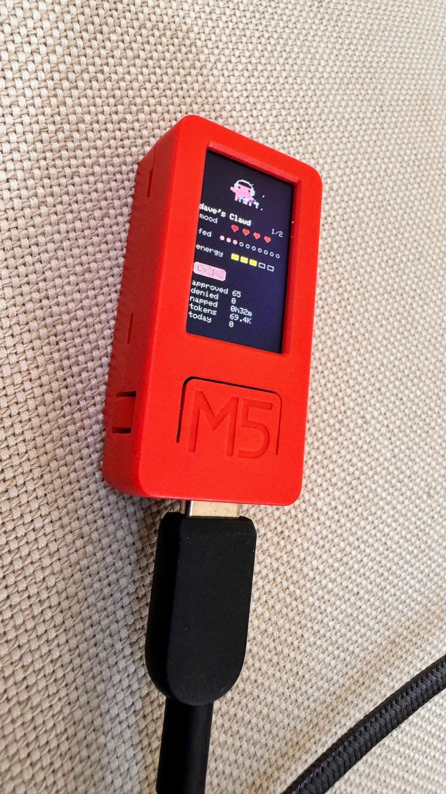
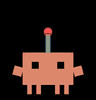
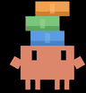
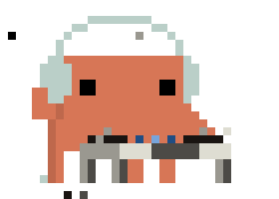

 

Immediately after watching [How the engineer behind Claude Cowork actually uses Claude | Felix Rieseberg (Anthropic)](https://youtu.be/-tdNsYi8AXs?t=2814), the tinkery part of my brain lit up and I found myself ordering a twenty-dollar [M5StickC PLUS](https://shop.m5stack.com/products/m5stickc-plus-esp32-pico-mini-iot-development-kit?variant=43983456764161).

The [Claude Desktop Buddy GitHub repo](https://github.com/anthropics/claude-desktop-buddy) code has everything you need to run the basic ASCII pets (18 variations!) and a GIF-pets example starring [the Bufo froge](https://www.linkedin.com/posts/jcbgrss_we-dont-talk-about-the-bufo-custom-slack-share-7305633604347301888-YP8w/). 

But, did I want ASCII pets? No. Bufo GIFs? No. I wanted Clawd GIFs. Animations of Claude's mascot. 

*Side note: At one point in my life I dreamt of working for Disney as an animator and while I've been lucky enough to have dipped my toes (fingers? cursors?) into a few treasured animation projects, I never dove deep into it.*

I really love Claude's Clawd animations. For me, they bring a lot of life and connection to the brand.

After receiving my M5StickC PLUS, flashing it and ensuring it worked with the ASCII pets and the Bufo example, my next step was sourcing some good Clawd animations.

I found some at these locations:

* [clawd-on-desk](https://github.com/rullerzhou-afk/clawd-on-desk/tree/main/assets/gif)
* [clawd-tank](https://github.com/marciogranzotto/clawd-tank/tree/master/assets/svg-animations)
* [Reverse-Engineering Claude AI’s Mascot Animations with SVG and GSAP](https://tympanus.net/codrops/2026/05/05/reverse-engineering-claude-ais-mascot-animations-with-svg-and-gsap/)
* [Claude FM 🎵 music for thinking and building](https://www.youtube.com/watch?v=tRsQsTMvPNg)
* and a few random GIFs

The repo has code under `tools` to help prep your GIFs, but I ended up using Claude + Fable/Opus to do my final GIF prep.

The 17 Clawd GIFs I ended up using, unlike the Bufo GIFs, are cropped individually (meaning Clawd isn't always the same size) and all together are just under the 1.8MB cap.

 attention

 busy_0

 busy_1

 busy_2

 busy_3

 busy_4

 busy_5

 celebrate

 dizzy

 heart

 idle_0

 idle_1

 idle_2

 idle_3

 idle_4

 idle_5

 sleep

If you want to try these, here's a ready-to-go [clawd.zip](clawd/clawd.zip), which contains the GIFs and the manifest.json. Just unzip and flash.

On the GIF-prep side, I was pleasantly surprised at how well Opus 5 was able to isolate a Clawd animation from the Claude FM livestream and generate a sharp GIF for me. I may never open Photoshop again.

