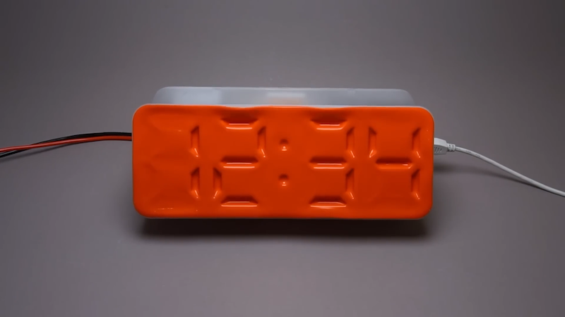
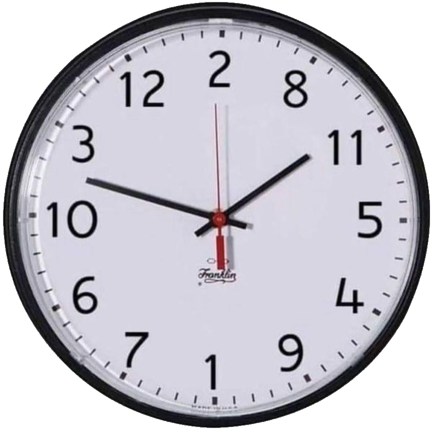
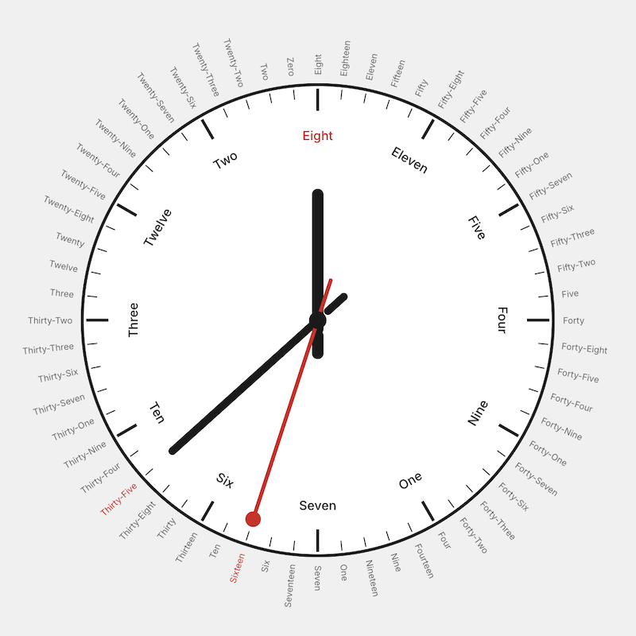

At the risk of turning my site into a clock blog... Would that really be so bad? 🤔 Anyway, more clocks!

<!--more-->

Air Powered Segment Display <a href="https://www.youtube.com/watch?v=E1BLGpE5zH0">link_2</a>

&nbsp;

Alphabetical Clock <a href="https://infosec.exchange/@catsalad/116268399785747534">link_2</a>

&nbsp;

The Accursèd Alphabetical Clock <a href="https://boat.horse/clock/index.html">link_2</a>