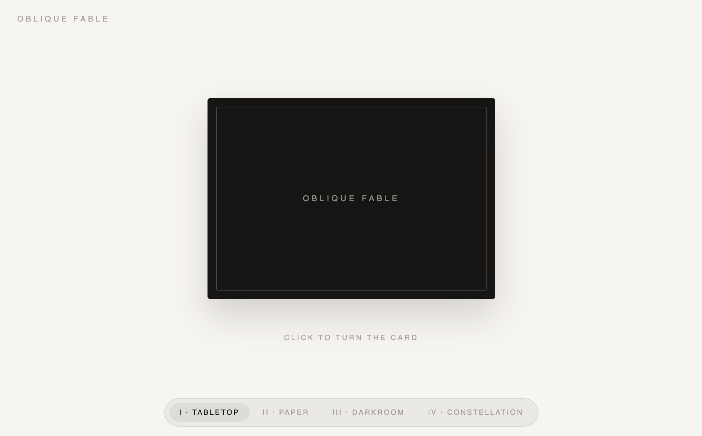
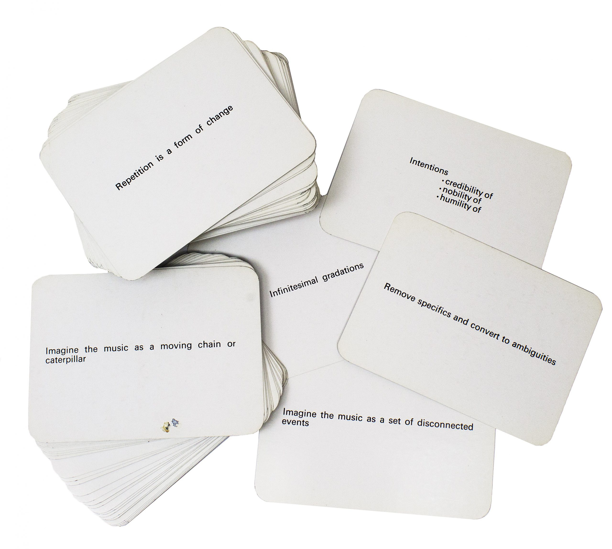
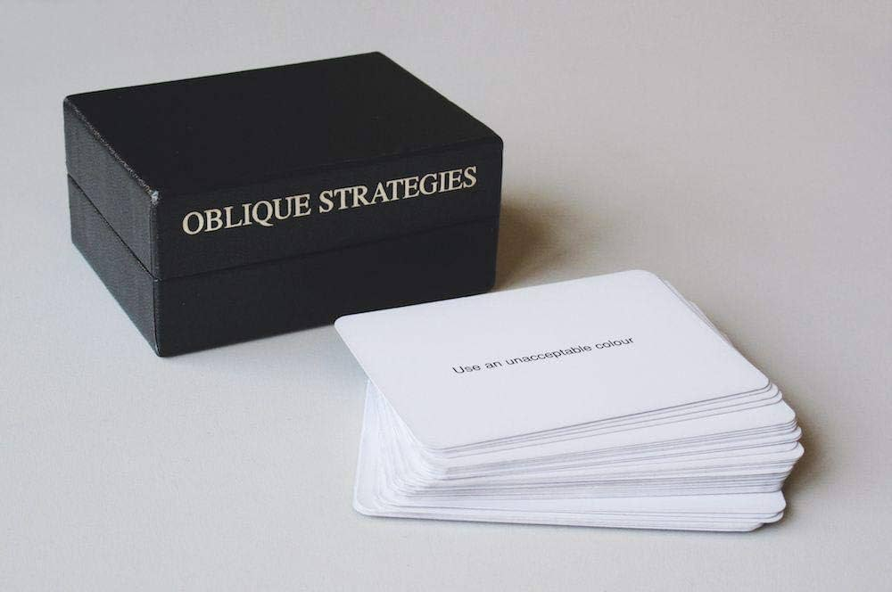
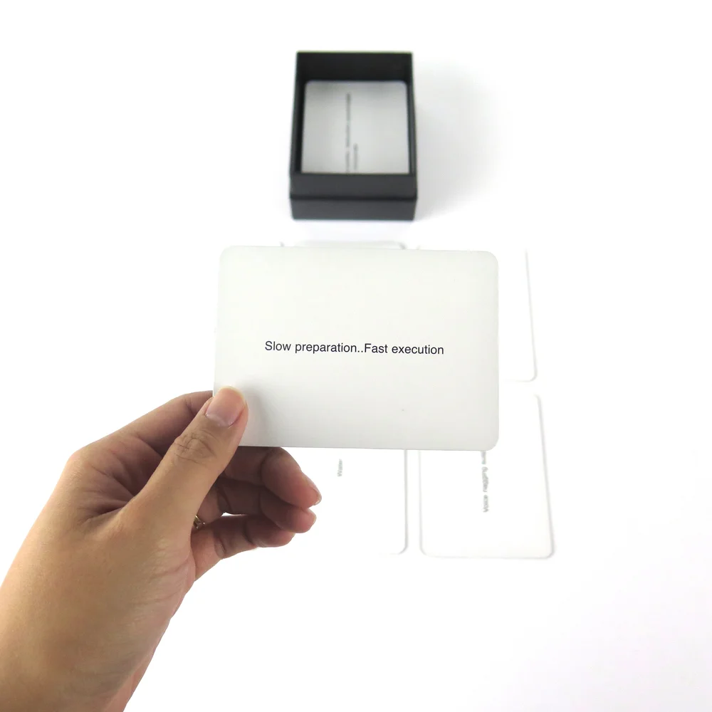
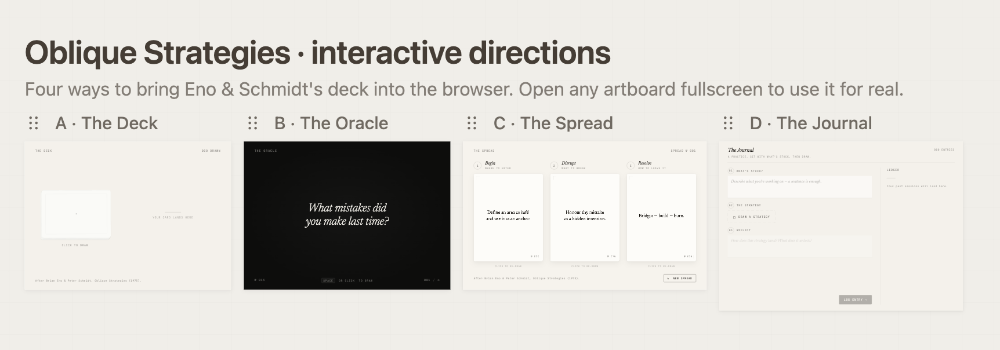
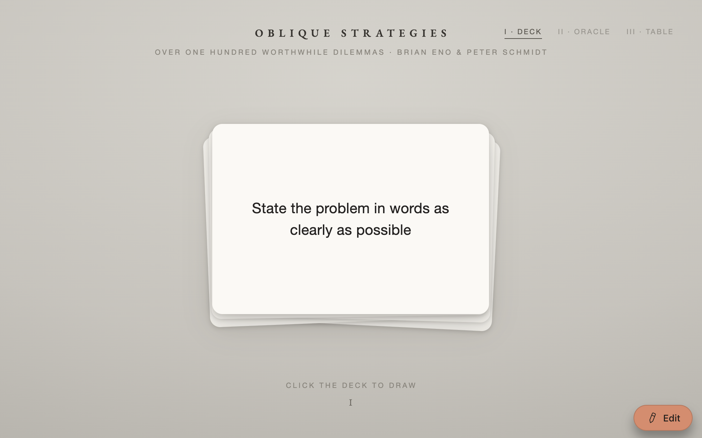
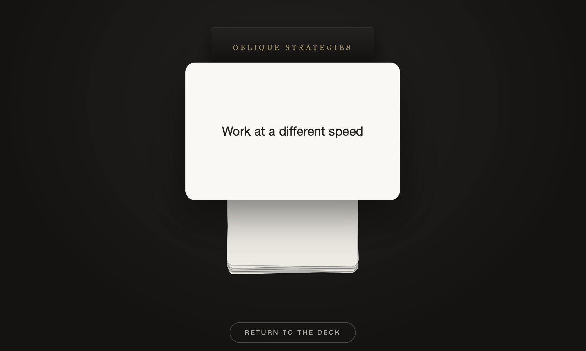
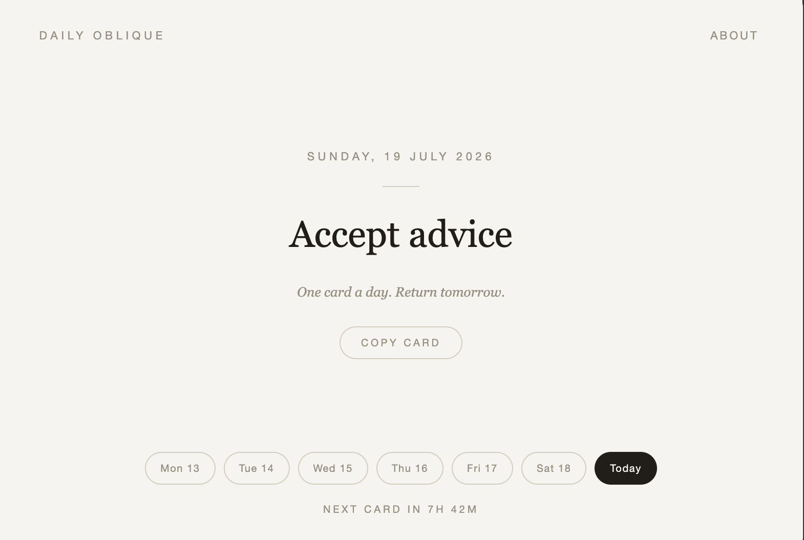

Following the release of Fable in early June, I thought a fun Claude Design + Fable project would be creating a virtual version of [Brian Eno's Oblique Strategies Deck](https://enoshop.co.uk/products/oblique-strategies?variant=51221629501780), a set of *lateral thinking dilemmas* I've long admired.

I got started shortly before our brilliantly boneheaded government made the questionable move of taking away our access to Fable. So, let's pause for hamstrings.

Anyway, I was more interested in initial output than a process of refinement, and what follows is all the former and none of the latter. A documentation of the process, if you will.

And before you say it out loud, there is irony in the fact that I never asked Claude to pull a card and consider it while concepting. For round five, perhaps?

### 01. First run and prompt:

> let's turn Brian Eno’s Oblique Strategies card deck into an interactive website. give me a few design options. they should all be interesting from an interactive perspective, but also simple and elegant. Keep the tech basic but you can use three.js if you have something special you want to do.

No template was defined and Claude had some questions (I said “decide for me” a lot), and here's the output:

 

<a href="../../projects/oblique/oblique-fable-01/">Oblique Fable 01 exported canvas</a>

>Four interactive studies are live in one file — switch between them with the pill at the bottom:
>
>I · Tabletop — stark and faithful to the physical deck: a black card on the table, click to turn it, click again to draw the next.
>
>II · Paper — warm analog: a worn paper stack in Garamond; drag the top card away in any direction to reveal the next.
>
>III · Darkroom — ambient ritual: press and hold, and the prompt slowly develops out of the dark like a photograph; release too early and it sinks back.
>
>IV · Constellation (three.js) — 36 cards drifting in space with mouse parallax; click and one flies to you, crisp and readable.

The results were pretty basic, nothing surprising, not very impressive considering all the hype.

All the hallmarks of [the Claude look and feel](https://www.newyorker.com/culture/infinite-scroll/the-ai-design-aesthetic-thats-taking-over-the-internet) are there too. 'Nuff said.

### 02. Second run and prompt:

> let's turn Brian Eno’s Oblique Strategies card deck into an interactive website. give me a few design options. they should all be interesting from an interactive perspective, but also simple and elegant.

For this round, I defined two templates to see what kind of impact they might have: Hi-fi design & Interactive prototype

I included the following images for additional context:

  

No questions this time, Claude jumped right in, here's the output:

 

<a href="../../projects/oblique/oblique-fable-02/">Oblique Fable 02 exported canvas</a>

>Four interactive directions are laid out on a canvas — open any artboard fullscreen (expand control in its header) to actually use it.
>
>A · The Deck — Pile of cards you click to draw from. Top card peels off, flips into the slot. Click it back to send it home.
>
>B · The Oracle — Black, full-bleed, italic typography. Press space (or click) to draw — strategy crossfades in.
>
>C · The Spread — Three cards in named roles (Begin / Disrupt / Resolve). Click any single card to re-draw just that one.
>
>D · The Journal — A practice loop: name what's stuck → draw a strategy → reflect → log it. Past entries persist locally.

Concepts A and B as expected. Concepts C and D, unusually fussy, overly complex.

### 03. Third run and prompt:

Identical prompt and images for additional context.

>let's turn Brian Eno’s Oblique Strategies card deck into an interactive website. give me a few design options. they should all be interesting from an interactive perspective, but also simple and elegant.

Defined two templates: Interactive prototype & Frontend design

 

<a href="../../projects/oblique/oblique-fable-03/">Oblique Fable 03 exported canvas</a>

Three concepts, but no write-up from Claude because... *You've hit your session limit. This limit is shared with your other Claude usage.*

### 04. Fourth and final run and prompt:

At this point, I've expended virtually zero effort on this "project" other than waiting (both for results and token resets), quickly reviewing, and even-more-quickly... passing judgement. Nothing has grabbed me. I'm wondering, why am I even doing this? What's in it for me when I'm not really doing *anything*?

But we were in a sort of limbo on that day and I was looking to keep myself occupied, so...

>let's turn Brian Eno’s Oblique Strategies card deck into an interactive website. give me a few design options. they should all be interesting from an interactive perspective, but also simple and elegant.

Yes, identical prompt and images for additional context.

Defined two templates: Hi-fi design & Interactive prototype

This time Claude "loved the brief" (lol), had a few questions, and provided the output:

 

<a href="../../projects/oblique/oblique-fable-04/">Oblique Fable 04 exported canvas</a>

>Four live directions are up — each frame is fully interactive:
>
>A · The Draw — click the deck, the top card lifts and flips toward you; faithful to the box-and-table ritual
>
>B · Emergence — the phrase condenses out of darkness over ~4s; click to dissolve it; optional ambient drone (bottom right)
>
>C · The Spread — the deck tipped out face-down; hover lifts, click turns a card in place, one face-up at a time
>
>D · Daily Oblique — one shared card per day, changing at midnight, with a week of history; quiet serif reinterpretation

And finally, a concept I could see using.

 

<a href="../../projects/oblique/daily-oblique/">Daily Oblique</a> draws one card a day. The same card for everyone. It changes at midnight.

