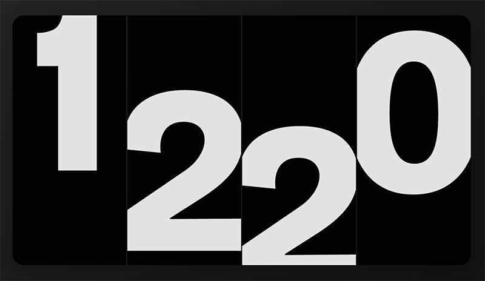

Aren't all designers moved by the display of time? A functional object with design potential that provides real-time feedback. What more could you ask for?

When I started coding with ai, I built a lot of clocks in different styles as a repeatable excercise to help me learn the process.

I didn't spend too much time on any of them, but I was reasonably happy with the way [this slide clock](../../projects/slide-clock/) turned out on desktop (sadly, not mobile-friendly). 

Inspired by the [Moving Digits](https://work.antonandirene.com/googlehome/2/) Google Home Hub concept from [Anton & Irene](https://work.antonandirene.com/).

