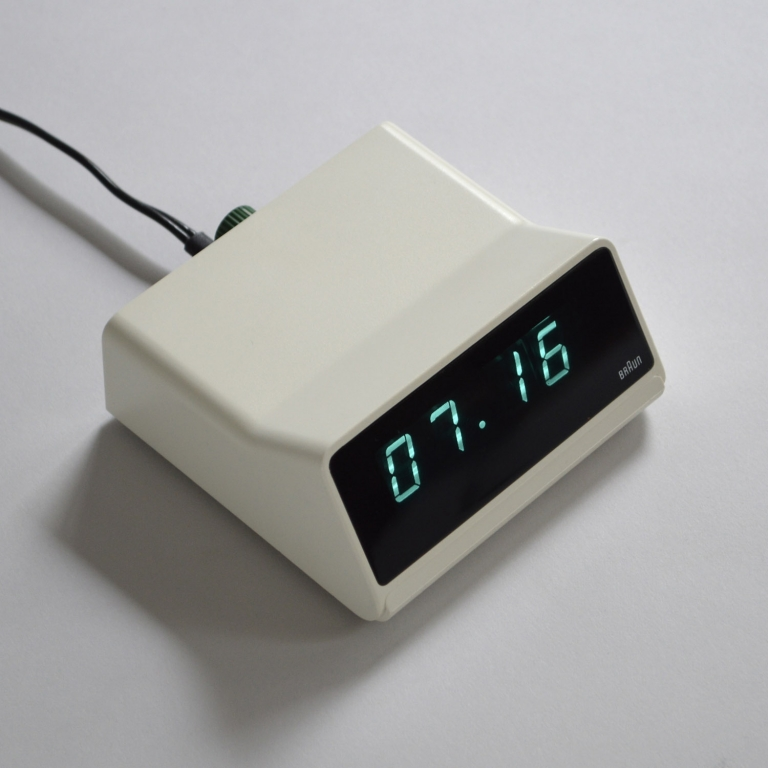
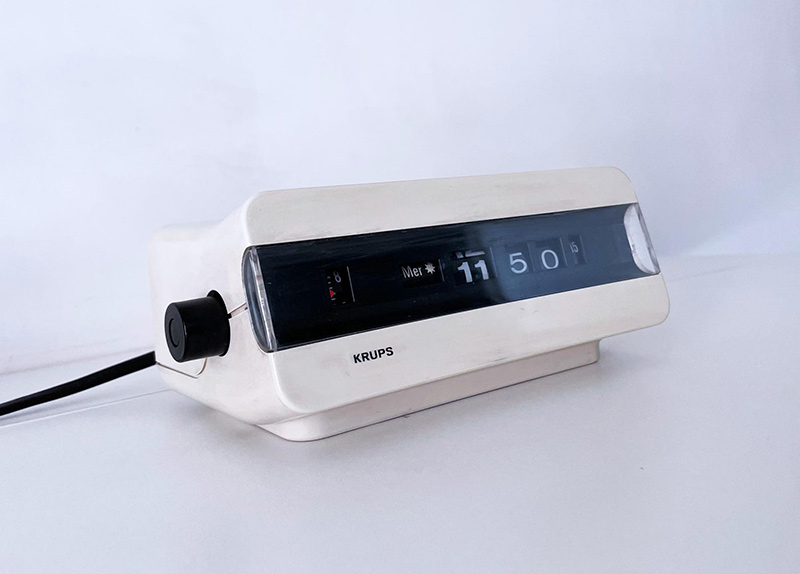
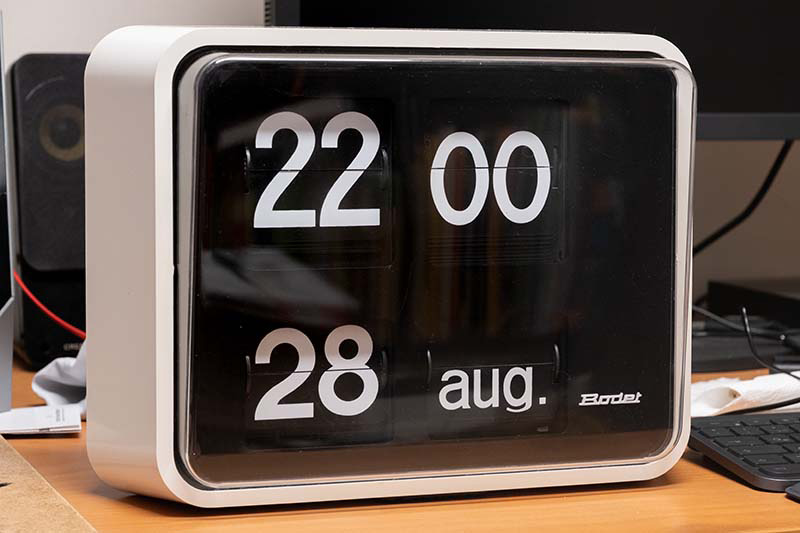
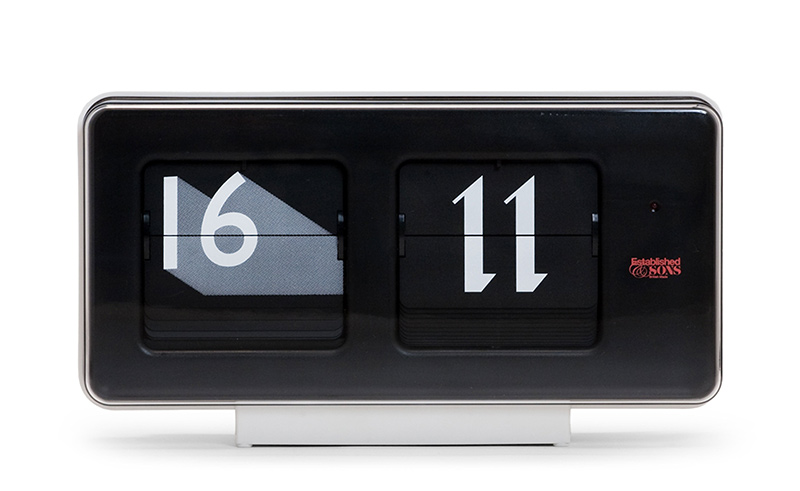

Some clocks I'm obsessed with.

<!--more-->

Dieter Rams: Braun DN 40 <a href="https://sgustokdesign.com/dieter-rams-braun-dn-40">link_2</a>

&nbsp;

KRUPS Model 621 <a href="https://www.etsy.com/listing/1800187329/1970s-italian-krups-flip-flap-alarm">link_2</a>

&nbsp;

Bodet BT 630 <a href="https://www.haraldkreuzer.net/en/news/bodet-bt-630-slave-flip-clock-esp32-control">link_2</a>

&nbsp;

Sebastian Wrong’s Font Clock <a href="https://establishedandsons.com/products/font-clock">link_2</a>